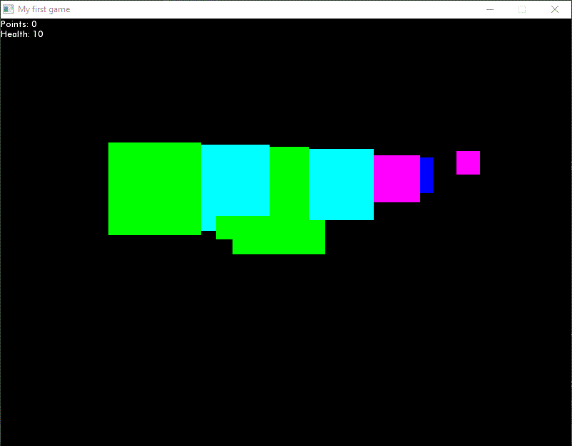
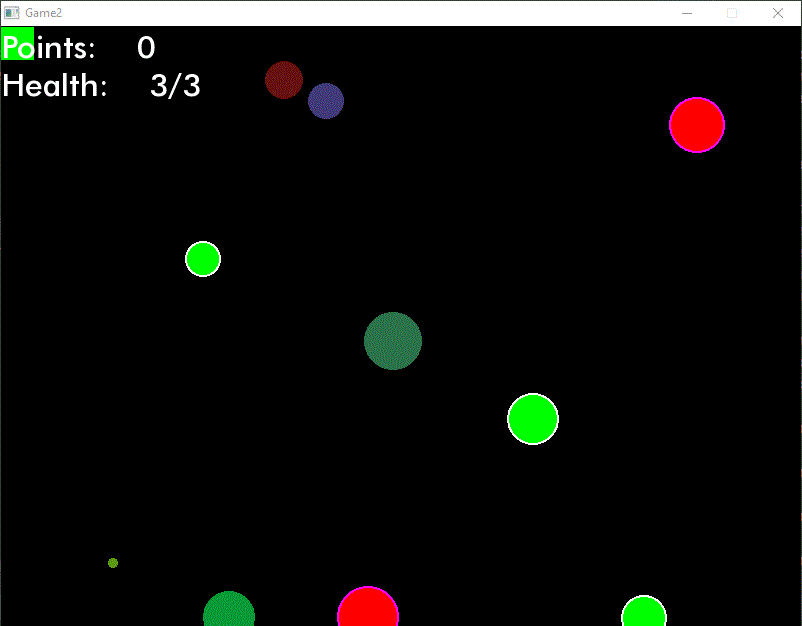
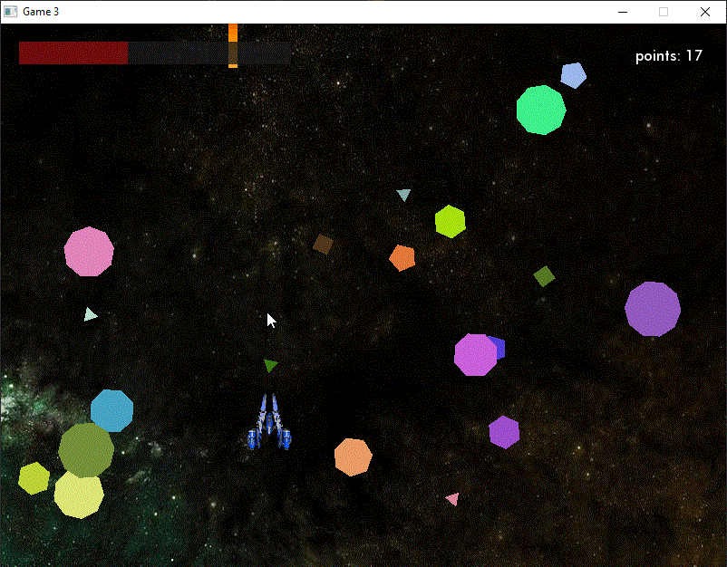

# My_SFML_Journey
My learning process of SFML/C++.

Started learning: May 2023

Currentlty learning from Suraj Sharma's tuts : https://www.youtube.com/@SurajSharmaFourKnob

I'm working in JetBrains CLion IDE.
SFML 2.5.1: GCC 7.3.0 MinGW (SEH) - 64-bit

### Game1

### Game2

### Game3

### Snake

